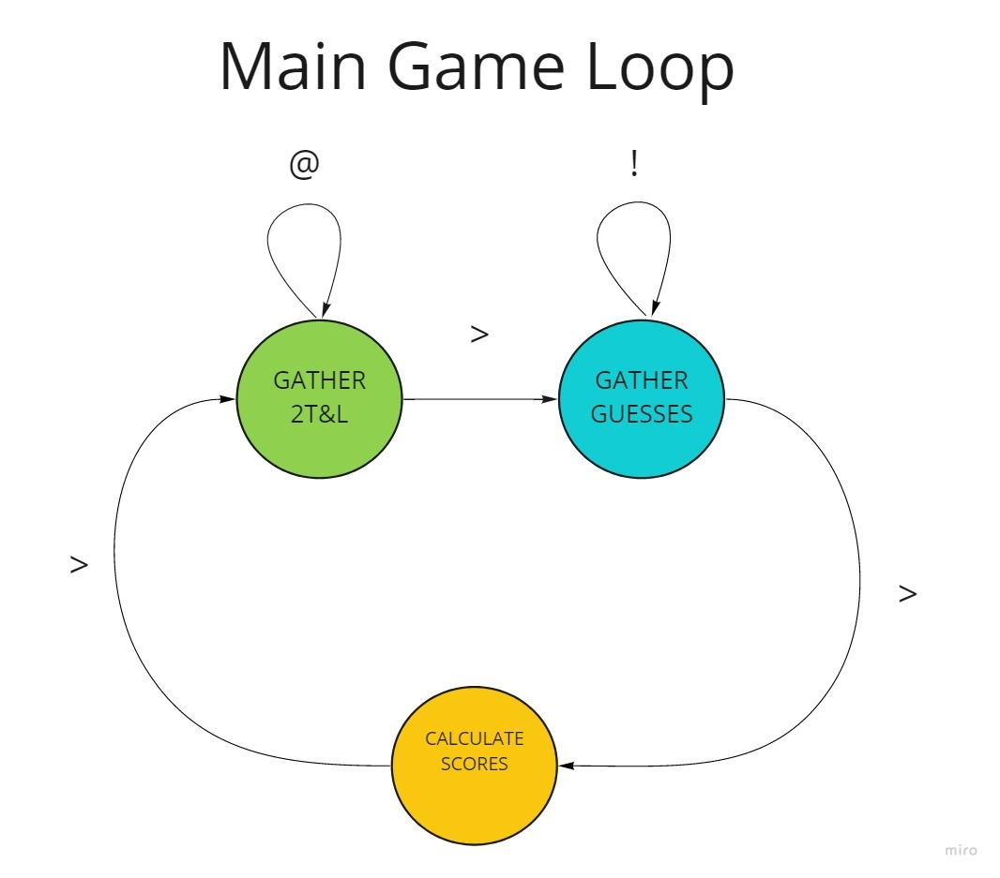
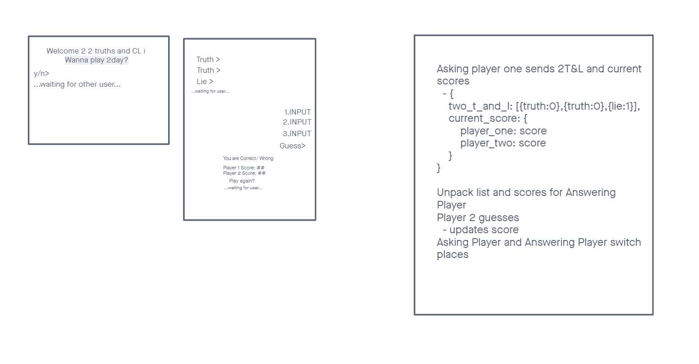

# Two Truths and a C-L-Lie

A multiplayer Two Truths and a Lie game played in the command line

## Project Description

### Project Purpose

The primarary purpose of this project was to gain a better understanding of what web sockets are and how they work. This was the first look at web sockets for all members of the team. We are using Fast API's web sockets alongside Gunicorn/Uvicorn to allow multiple users to connect to one another.

### Development Hurdles

A large issue we ended facing early in the development process was how complex handling async input can get. After looking into asyncio and attempting to handle the issue with threading, we went back and eventually settled upon a loosely implemented Finite State Machine model.

### Our Solution

Our main game loop starts off in the collecting statements state. Once everyone has entered their statement, the last user to enter is prompted to input a '>' to move the game into the guessing state where everyone can guess on the statements everyone sent in previously. After every statement everyone's score is broadcasted. Once all statements have been guessed on, the game moves back to the collecting statements state and the loop starts over.

### Next features to be added include:

- Resolving inconsistant behavior with the Heroku deployment
- Packaging the client to be run as an executable

## Colaborators

Samuel Panek
[https://github.com/spamuelranek](https://github.com/spamuelranek)

Joseph Nguyen
[https://github.com/3lueHippo](https://github.com/3lueHippo)

Andrew Kim
[https://github.com/KimrAndrew](https://github.com/KimrAndrew)

### Project Managment

[https://trello.com/b/B0K3EJpS](https://trello.com/b/B0K3EJpS)

### Wireframe

